# Azure Context Cache 与 AI Agent 缓存机制学习笔记

## 1. 文档说明

本文结合以下两份资料进行讲解：

- `Azure_Context_Cache_JiqingYou_V260801.pdf`
- `Microsoft_AI_Agent_Tech_Stack.pdf`

第一份资料共 12 页，重点介绍 Prompt Caching 的基本原理、GPT-5.6 中隐式与显式缓存断点的变化，以及 Azure Context Cache 如何解决节点本地缓存命中率不稳定的问题

第二份资料是一页总览图，把缓存分为隐式缓存、扩展缓存和显式缓存三个层次，帮助我们理解不同缓存技术分别解决什么问题

文中的产品状态、模型版本、区域、计费和 Private Preview 限制来自资料本身，是 2026 年 8 月附近的资料快照。实际使用前仍需核对最新 Azure 文档和价格页面

## 2. 先建立一个整体认识

大模型的 Prompt Cache 通常缓存的不是模型最终生成的答案，而是模型处理输入前缀后形成的中间计算结果，也就是常说的 KV cache

例如，Codex 每次请求都带有：

```text
固定的系统提示词
+ 仓库规则
+ 工具定义
+ 已读取的文件
+ 历史对话
+ 本轮新问题
```

如果前面很长一段内容和上一次请求完全一致，模型没有必要重新计算全部前缀。它可以读取缓存，只计算本轮新增的尾部

这可以同时改善：

- 输入 Token 成本
- 首 Token 延迟，也就是 TTFT
- 推理节点的计算量
- 长对话和 Agent 循环的整体吞吐

但缓存命中有一个关键前提：

> 请求开头的 Token 序列必须稳定，而且请求必须被路由到能够找到这份缓存的位置

第一部分是 Prompt 组织问题，第二部分是缓存架构和请求路由问题

## 3. 三类缓存的总体区别

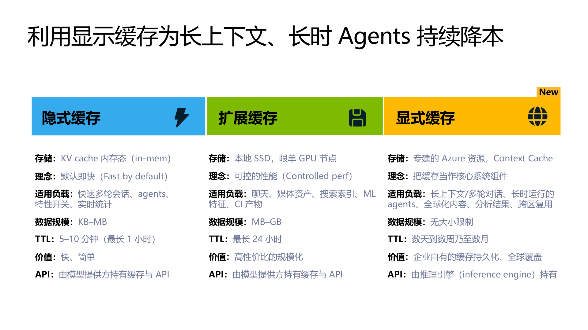

这张图把缓存分成三个层次

| 类型 | 存储位置 | 典型生命周期 | 主要目标 | 适合场景 |
|---|---|---:|---|---|
| 隐式缓存 | 推理节点内存中的 KV cache | 5 到 10 分钟，最长约 1 小时 | 默认加速相邻请求 | 快速多轮对话、短 Agent 循环 |
| 扩展缓存 | 单个 GPU 节点的本地 SSD | 最长约 24 小时 | 用更大容量换取更稳定的节点内复用 | 聊天、媒体、搜索索引、ML 特征和 CI 产物 |
| 显式缓存 | 独立 Azure Context Cache 资源 | 数天、数周甚至数月 | 把缓存变成可管理、持久化的系统组件 | 长上下文、长时 Agent、多用户和跨节点复用 |

### 3.1 隐式缓存

隐式缓存由模型服务自动维护。应用不需要创建独立缓存资源，只要后续请求具有相同前缀，就可能命中

它的优势是简单和快速，问题是缓存通常绑定在某个推理节点上。请求被负载均衡到另一个节点、Agent 等待工具执行太久，或者缓存过期后，都可能无法命中

### 3.2 扩展缓存

扩展缓存把缓存从内存扩展到节点本地 SSD，可以保存更大数据并延长生命周期

但它仍然是节点本地缓存。只要请求被发送到其他 GPU 节点，缓存就可能不可见

### 3.3 显式缓存

显式缓存把缓存从推理节点中独立出来，变成专门的 Azure 资源

它关注的不只是单次请求更快，而是：

- 多个推理节点共享同一份缓存
- 多个用户复用相同的系统提示词
- Agent 在长时间工具调用后仍能继续使用缓存
- 缓存可以具有更长 TTL
- 缓存生命周期可以作为系统架构的一部分管理

资料标题中的“显示缓存”结合正文语义应理解为“显式缓存”

## 4. Azure Context Cache 逐页讲解

### 4.1 第 1 页：主题与目标

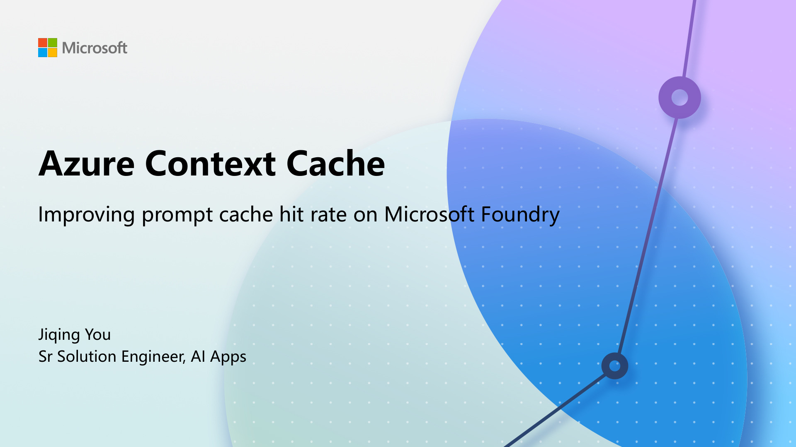

这一页给出了资料的核心目标：提高 Microsoft Foundry 中 Prompt Cache 的命中率

重点不是发明一种新的 Token，而是解决传统节点本地 Prompt Cache 在真实流量中不稳定的问题

### 4.2 第 2 页：Prompt Caching 如何工作

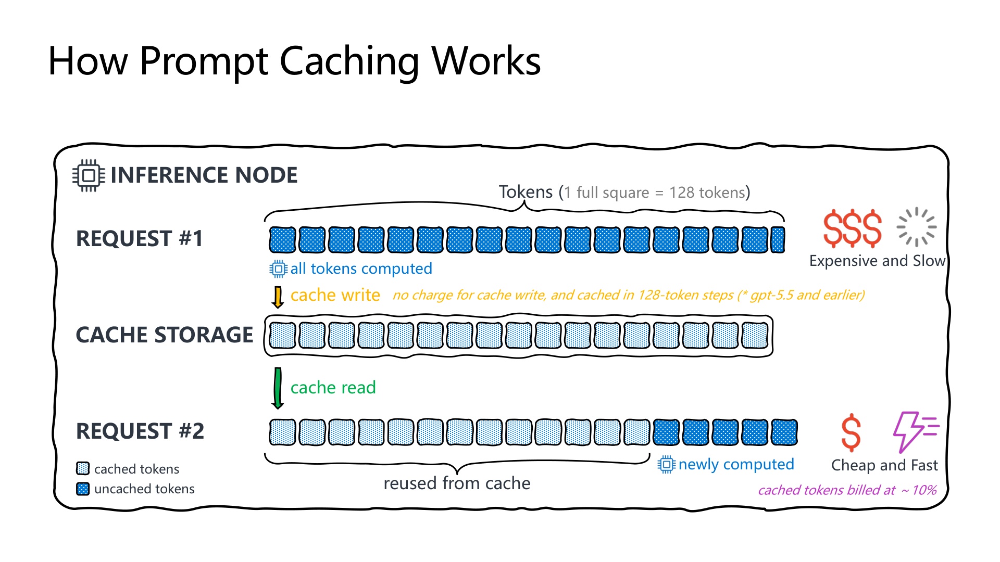

第一次请求到达推理节点时，没有可复用的缓存，所以全部输入 Token 都需要计算。计算完成后，服务把可缓存前缀对应的 KV 状态写入缓存

第二次请求如果拥有相同前缀：

```text
相同前缀 -> 从缓存读取
新增尾部 -> 重新计算
```

图中浅色方块代表缓存命中的 Token，深色方块代表本次仍需计算的 Token

对于 GPT-5.5 及更早模型，资料给出的行为是：

- 缓存按 128 Token 步长保存
- 写入缓存不另外收费
- 缓存读取 Token 的价格约为普通输入 Token 的 10%

这里的“快”主要是减少前缀预填充计算，并不意味着生成阶段也会按相同比例加速。如果输出很长，最终总耗时仍可能主要由输出生成决定

### 4.3 第 3 页：什么决定缓存命中

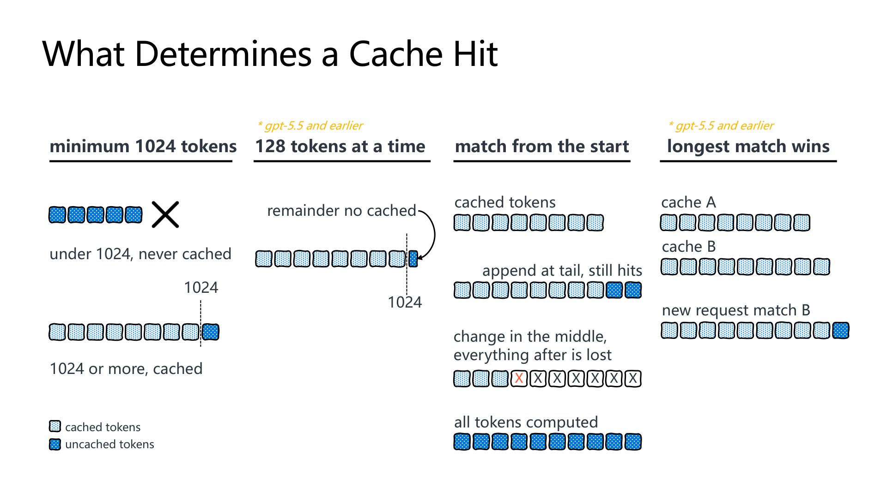

这一页包含四条关键规则

#### 最少 1024 Token

资料中的模型只有在可缓存前缀达到至少 1024 Token 时才开始缓存。短提示词即使完全重复，也不会形成缓存收益

#### 以固定 Token 步长增长

对于 GPT-5.5 及更早模型，缓存按 128 Token 为一个增量。超过完整步长但不足下一个步长的尾数不会进入缓存

#### 必须从开头匹配

Prompt Cache 是前缀缓存

在尾部追加新消息不会破坏前面的缓存，但修改中间内容后，修改点之后的 Token 都不能继续复用

```text
稳定系统提示词 + 稳定工具定义 + 新用户问题
^^^^^^^^^^^^^^^^^^^^^^^^^^^^^   ^^^^^^^^^^
         可以缓存                 本次计算
```

如果把时间戳、随机 ID、请求 ID 或动态用户信息放在最前面，每次请求都会很早发生变化，后面即使有大量相同内容也无法命中

#### 最长匹配优先

如果已有多个缓存前缀，新请求会选择能够匹配的最长前缀。匹配越长，需要重新计算的尾部越短

### 4.4 第 4 页：GPT-5.6 的写入计费变化

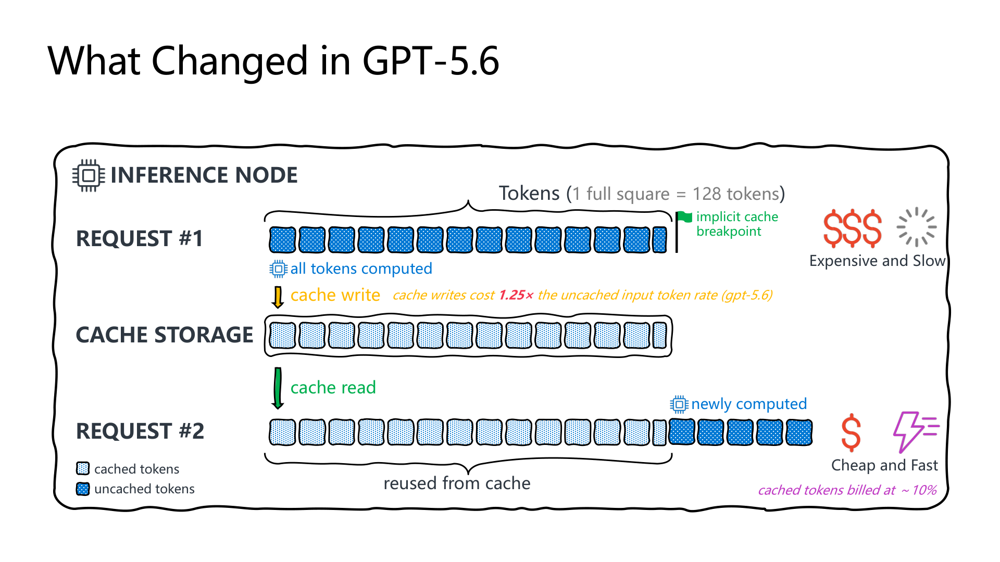

资料指出 GPT-5.6 的缓存写入需要计费，写入价格为普通未缓存输入 Token 的 1.25 倍；缓存读取仍约为普通输入价格的 10%

因此，缓存不再是“写入没有成本，命中就是赚到”，而是需要计算盈亏平衡点

假设一段前缀包含 `P` 个 Token，普通输入单价归一化为 1：

```text
不使用缓存，重复 N 次的成本 = N × P

写入一次并读取 N - 1 次的成本
= 1.25 × P + 0.1 × (N - 1) × P
```

两次使用时：

```text
不缓存：2P
缓存：1.25P + 0.1P = 1.35P
```

只要第二次真正命中，仍可能明显节省成本。但如果写入后没有再次命中，就会比普通输入更贵

这意味着 GPT-5.6 更需要把缓存放在稳定、可重复使用的前缀上，而不是盲目缓存所有输入

### 4.5 第 5 页：隐式和显式断点

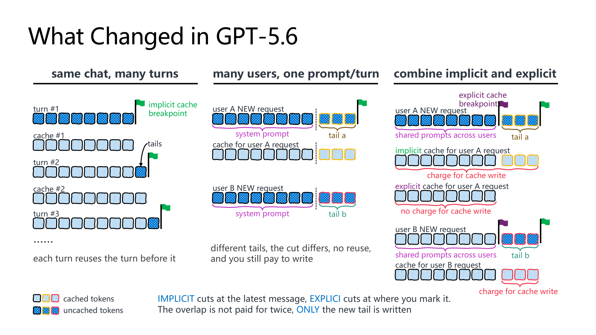

这页分为三个场景

#### 同一个会话，多轮对话

隐式缓存断点位于最新消息附近

```text
第 1 轮：系统提示词 + 用户问题 1
第 2 轮：第 1 轮上下文 + 用户问题 2
第 3 轮：第 2 轮上下文 + 用户问题 3
```

每一轮都能复用上一轮的大部分前缀，只计算新增加的尾部。这非常适合同一个 Codex 或 Agent 会话中的连续模型调用

#### 多个用户，共享前缀但尾部不同

先把一次请求拆成两部分：

```text
S = 所有用户共享的稳定系统提示词
A = 用户 A 的问题和上下文
B = 用户 B 的问题和上下文

用户 A 的请求 = S + A
用户 B 的请求 = S + B
```

假设 `S` 有 12000 Token，`A` 和 `B` 各有 4000 Token

只使用隐式缓存时，服务自动把断点放在当前请求的最新消息附近。于是第一次处理用户 A 时，形成的缓存候选是：

```text
隐式缓存 A = [S + A]，共 16000 Token
```

用户 B 的请求是：

```text
[S + B]
```

它虽然也以 `S` 开头，但缓存系统之前只在 `S + A` 的末尾建立了隐式断点，没有把 `S` 的末尾单独标记为一个可共享断点。比较到 `S` 后，下一段已经从 `A` 变成 `B`，所以不能命中完整的 `S + A` 缓存

结果是用户 B 还要形成另一份缓存：

```text
隐式缓存 B = [S + B]，共 16000 Token
```

问题不在于系统提示词完全不同，而在于服务只自动保存了两个不同的完整前缀：

```text
[S + A] != [S + B]
```

共同的 `S` 没有被单独划出一个所有用户都可以复用的缓存边界。这就是“用户 A 和用户 B 共享相同系统提示词，但无法充分共享缓存”的含义

隐式缓存并非完全没有价值。用户 A 进入下一轮时：

```text
用户 A 第 2 轮 = S + A + A2
```

它可以命中之前的 `S + A`，只计算和写入新增的 `A2`。因此隐式缓存很适合同一个用户、同一个会话连续增长的场景

#### 什么是隐式断点

隐式断点由模型服务自动选择，通常位于请求中最新消息的末尾附近

从应用开发者角度看，它的特点是：

- 不需要在 Prompt 的具体内容中指定断点位置
- 服务根据完整请求自动决定缓存到哪里
- 很适合同一个会话逐轮追加消息
- 不容易把多个用户共享的公共前缀单独分离出来

资料指出，不传 `prompt_cache_options` 时仍然可以保持旧模型的自动 Prompt Caching 行为。但在 GPT-5.6 示例中，显式传入：

```python
prompt_cache_options={"mode": "implicit"}
```

可以明确启用隐式模式，并让 usage 返回 `cache_write_tokens`

这里的“隐式”不是应用完全不能控制，而是应用只声明使用自动模式，不指定准确的 Token 边界

#### 什么是显式断点

显式断点由应用开发者放在 Prompt 中一个确定的位置

它相当于告诉模型服务：

> 请把从请求开头到这里的完整前缀，单独作为一个可复用缓存边界

在这个例子里，应把断点放在共享系统提示词 `S` 的末尾：

```text
[共享系统提示词 S] | 显式断点 | [用户专属内容 A 或 B]
```

这样服务会得到一份独立的公共缓存：

```text
显式缓存 = [S]，共 12000 Token
```

之后无论请求尾部是 `A` 还是 `B`，只要开头的 `S` 完全一致，都可以先读取这 12000 Token 的共享缓存

资料中的 Responses API 写法是把 `prompt_cache_breakpoint` 放到稳定内容项上：

```python
response = client.responses.create(
    model="gpt-5.6-sol",
    prompt_cache_options={"mode": "implicit"},
    input=[
        {
            "role": "developer",
            "content": [
                {
                    "type": "input_text",
                    "text": shared_system_prompt,
                    "prompt_cache_breakpoint": {"mode": "explicit"},
                }
            ],
        },
        {
            "role": "user",
            "content": [
                {
                    "type": "input_text",
                    "text": user_message,
                }
            ],
        },
    ],
)
```

两个配置的层级不同：

| 配置 | 放在哪里 | 作用 |
|---|---|---|
| `prompt_cache_options={"mode": "implicit"}` | 整个请求 | 允许服务在请求尾部自动建立隐式断点 |
| `prompt_cache_breakpoint={"mode": "explicit"}` | 某个具体内容项 | 明确要求在该内容结束位置建立共享断点 |

API 字段和支持模型可能随预览版本变化，实际调用时需要以对应模型版本的最新接口定义为准

#### 组合隐式和显式断点

可以在稳定系统提示词后设置显式断点，再让每个用户的请求继续使用隐式缓存

```text
共享系统提示词 | 显式断点 | 用户专属上下文 | 隐式断点
```

这样会形成两层缓存

第一层是所有用户共享的显式缓存：

```text
公共显式缓存 = [S]
```

第二层是每个会话自己的隐式扩展：

```text
用户 A 隐式缓存 = [S] + [A]
用户 B 隐式缓存 = [S] + [B]
```

完整过程如下

##### 用户 A 第一次请求

```text
请求：[S] | 显式断点 | [A] | 隐式断点

结果：
1. 写入公共显式缓存 S
2. 写入用户 A 的新增尾部 A
```

##### 用户 B 第一次请求

```text
请求：[S] | 显式断点 | [B] | 隐式断点

结果：
1. 命中公共显式缓存 S
2. 只计算并写入用户 B 的新增尾部 B
```

用户 B 不需要再次为整个 `S + B` 做缓存写入。它先读取共享的 `S`，再写自己的 `B`

##### 用户 A 第二轮请求

```text
请求：[S] | 显式断点 | [A] + [A2] | 隐式断点

结果：
1. 命中 S
2. 命中 A
3. 只计算并写入新增的 A2
```

因此，两者的职责可以记成：

```text
显式断点：固定一个“大家共同从哪里复用”的边界
隐式断点：自动追踪“当前会话已经增长到哪里”
```

#### 为什么重叠部分不会重复计费

用户 A 的隐式缓存逻辑上包含：

```text
[S + A]
```

其中 `S` 已经存在于显式缓存中。服务扩展到 `S + A` 时，不需要把 `S` 再写一遍，只需要写新增的 `A`

可以把它理解成基于已有前缀继续追加：

```text
已有：S
新增：A
结果：S + A
本次缓存写入计费：只计算 A
```

同理，用户 A 下一轮从 `S + A` 扩展到 `S + A + A2` 时，只写 `A2`

这不是说缓存读取完全免费。已经存在的 `S` 和 `A` 会按照 cached token 的读取价格计费；“不重复计费”具体指它们不会再次被计入 `cache_write_tokens`

#### 一个更直观的类比

可以把显式缓存理解为团队共享的 Git 基础分支：

```text
main = 公共系统提示词 S
```

用户 A 和用户 B 各自在这个共同基础上创建自己的分支：

```text
branch-a = main + A
branch-b = main + B
```

`main` 只需要保存一次。A 和 B 只保存各自新增的部分。后续 A 再提交 `A2`，也只增加 `A2`

如果没有显式公共断点，就更像系统分别保存了两个完整快照 `S + A` 和 `S + B`，共同的 `S` 没有被明确抽成共享基础

### 4.6 第 6 页：`prompt_cache_options`

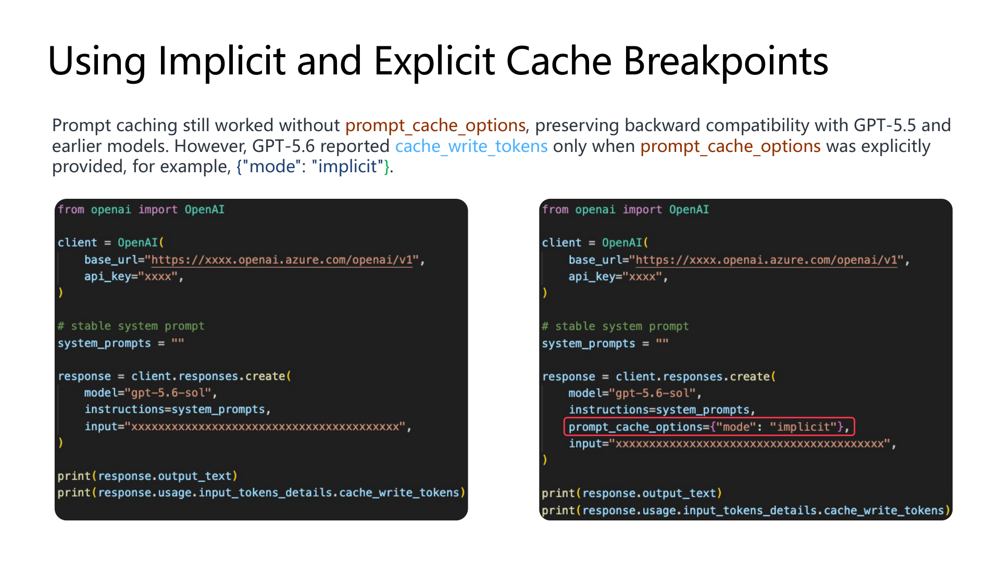

资料给出的 Responses API 示例使用：

```python
response = client.responses.create(
    model="gpt-5.6-sol",
    instructions=system_prompts,
    prompt_cache_options={"mode": "implicit"},
    input="...",
)
```

不提供 `prompt_cache_options` 时，Prompt Caching 仍然工作，以保持与 GPT-5.5 及更早模型的兼容

但资料指出，GPT-5.6 只有显式提供该字段后，usage 中才报告：

```text
cache_write_tokens
```

因此，这个字段不仅控制或声明缓存模式，也影响缓存写入指标的可观测性

### 4.7 第 7 页：显式前缀和隐式扩展的计算示例

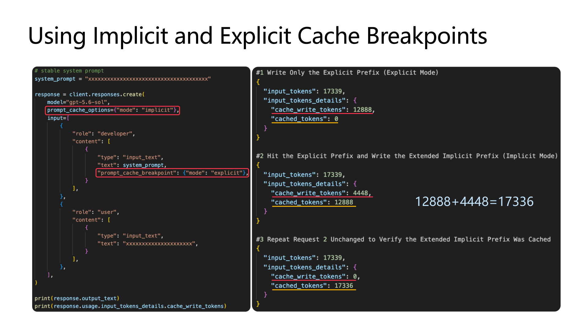

代码在稳定系统提示词内容上设置显式缓存断点，同时在请求级别设置隐式模式

三个请求展示了缓存逐步形成的过程

| 请求 | `cache_write_tokens` | `cached_tokens` | 含义 |
|---|---:|---:|---|
| 第一次 | 12888 | 0 | 首次写入显式稳定前缀 |
| 第二次 | 4448 | 12888 | 命中显式前缀，并把新增尾部写成隐式缓存 |
| 第三次 | 0 | 17336 | 请求不变，完整前缀全部命中 |

图中的：

```text
12888 + 4448 = 17336
```

表示第三次请求可直接读取的缓存，由第一次写入的稳定前缀和第二次写入的扩展尾部组成

这个例子体现了两级缓存结构：

```text
显式缓存：跨请求共享的稳定部分
隐式缓存：当前会话继续增长的部分
```

### 4.8 第 8 页：Cache Key 只能改善路由概率

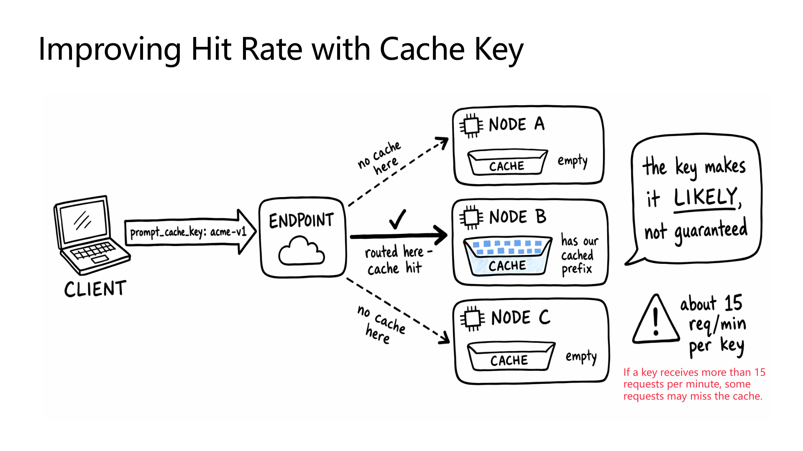

传统 Prompt Cache 位于具体推理节点上。假设缓存存在 Node B，但新请求被负载均衡到 Node A 或 Node C，就无法命中

`prompt_cache_key` 可以让相同 Key 的请求更可能被路由到同一节点

适合放进 Key 的通常是稳定分组标识，例如：

```text
应用版本
Agent 类型
系统提示词版本
知识库版本
租户或业务分组
```

不适合直接使用每次都变化的 request ID，否则每个请求都会形成新分组

图中明确强调：

> Cache Key 只能让命中更有可能，并不提供保证

资料还提示，单个 Key 超过大约每分钟 15 个请求时，部分请求仍可能因为扩容和负载均衡而被分散到其他节点

### 4.9 第 9 页：Azure Context Cache 解决什么问题

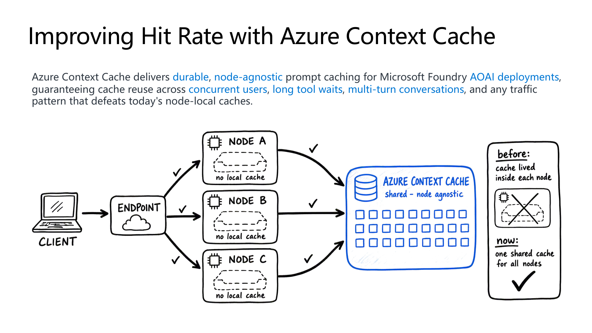

Azure Context Cache 把缓存从单个推理节点中移出，形成所有节点可以访问的共享缓存

之前：

```text
Node A -> 只能看到 Node A 的缓存
Node B -> 只能看到 Node B 的缓存
Node C -> 只能看到 Node C 的缓存
```

之后：

```text
Node A ─┐
Node B ─┼─> Azure Context Cache
Node C ─┘
```

它重点解决：

- 并发用户被分散到不同节点
- Agent 执行工具时间较长，节点本地缓存已经过期
- 多轮会话不一定持续落在同一节点
- 扩缩容后原节点缓存不可见
- Cache Key 无法保证请求亲和性

因此，Azure Context Cache 的价值不是单纯把缓存做大，而是让缓存从“某个节点的临时优化”变成“部署级共享能力”

### 4.10 第 10 页：Azure Context Cache 架构

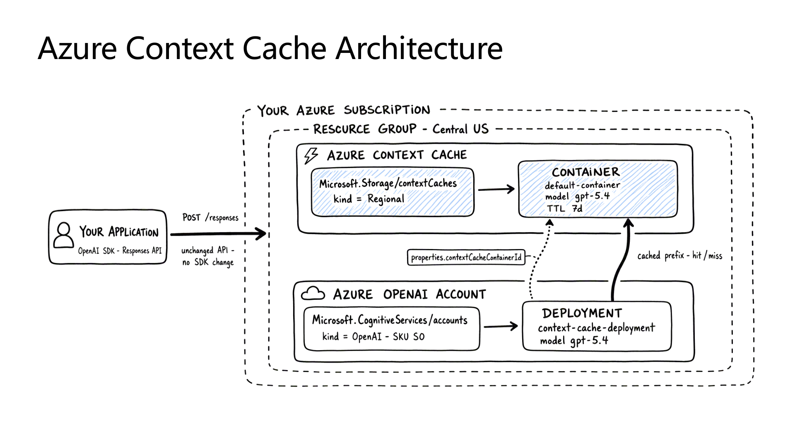

图中包含两类 Azure 资源

#### Azure OpenAI Account 和 Deployment

这是实际执行模型推理的资源。示例部署使用 Context Cache 专用模型版本

#### Azure Context Cache 和 Container

这是独立缓存资源。一个 Context Cache 下包含 Container，Container 配置模型和 TTL

示例中：

```text
Context Cache
└── Container
    ├── model: gpt-5.4
    └── TTL: 7 days
```

Deployment 通过 `properties.contextCacheContainerId` 关联到缓存 Container

应用仍然通过 OpenAI SDK 和 Responses API 调用模型，图中标注 `unchanged API` 和 `no SDK change`。也就是说，应用的推理请求入口不变，缓存资源关联主要发生在 Azure 资源配置层

缓存命中或未命中由 Deployment 与 Context Cache Container 之间的关联处理

### 4.11 第 11 页：Private Preview 限制

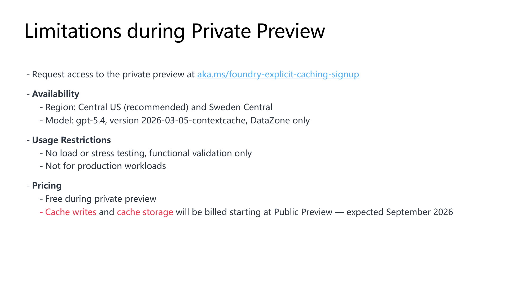

资料中的预览限制包括：

| 项目 | 资料中的说明 |
|---|---|
| 申请方式 | 通过指定链接申请 Private Preview |
| 区域 | Central US，推荐；Sweden Central |
| 模型 | `gpt-5.4` |
| 模型版本 | `2026-03-05-contextcache` |
| 部署类型 | DataZone only |
| 测试限制 | 只允许功能验证，不允许负载或压力测试 |
| 生产使用 | 不可用于生产负载 |
| Private Preview 价格 | 免费 |
| Public Preview 计划 | 资料预计 2026 年 9 月 |
| 后续计费 | Cache write 和 cache storage 计划收费 |

这些信息具有明显时效性。尤其是区域、模型版本、是否允许生产使用和价格，不能只依据这份演示稿长期沿用

### 4.12 第 12 页：结束页

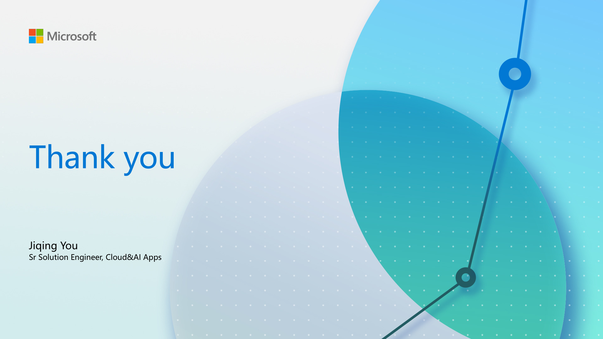

这一页没有新增技术内容，用于结束演示

## 5. 两份资料合起来表达的核心架构

两份资料可以组合成下面的理解：

```text
第一层：隐式 Prompt Cache
目标：让相邻模型请求自动复用前缀
特点：最快、最简单，但容易受节点和 TTL 影响

第二层：节点扩展缓存
目标：扩大单节点容量和生命周期
特点：容量更大，但仍然受节点边界限制

第三层：Azure Context Cache
目标：跨节点、跨会话、长周期地复用稳定上下文
特点：独立资源、可配置 TTL、适合企业级长时 Agent
```

显式缓存并不是隐式缓存的完全替代品。更合理的方式是组合使用：

```text
长期稳定知识和系统规则 -> 显式缓存
单次会话不断增长的历史 -> 隐式缓存
每轮新问题和工具结果 -> 正常计算
```

## 6. 对 Codex 和长时 Agent 的实际意义

### 6.1 代码审查

代码审查任务通常包含稳定的仓库规则、工具定义和代码上下文，以及不断变化的具体 diff

推荐顺序：

```text
系统指令
仓库规范
工具定义
通用审查规则
文件内容或稳定代码上下文
本次 diff
用户问题
```

稳定内容放在前面，变化最大的 diff 和问题放在后面，更有利于前缀缓存命中

### 6.2 生成或修复代码

Codex 可能在一个任务里多次调用模型：

```text
理解任务
读取文件
分析代码
修改代码
运行测试
分析失败日志
继续修复
生成总结
```

每次模型调用都是独立请求，但这些请求通常共享相同的系统提示词、仓库规则、工具定义和大部分对话历史

Prompt Cache 节省的是这些重复请求中的共享前缀成本，不是把整个任务直接变成一次请求

### 6.3 长时间工具调用

Agent 运行测试、构建镜像或等待外部系统时，可能间隔数分钟甚至更久

短 TTL 的节点内存缓存可能在下一次模型调用前失效。独立且持久的 Context Cache 更适合这种：

```text
模型调用 -> 工具执行很久 -> 再次模型调用
```

### 6.4 多用户共享 Agent 模板

企业内多个用户可能使用相同的：

- Agent 系统提示词
- 安全规则
- 工具定义
- 编码规范
- 产品或仓库背景

可以把这一段作为显式共享前缀，并在后面追加每个用户自己的任务和会话历史

这样既能跨用户复用公共部分，又不会把用户专属尾部混在共享缓存中

## 7. 如何设计更容易命中的 Prompt

推荐遵循下面的顺序：

```text
最稳定
  系统提示词
  安全和合规规则
  工具 Schema
  Agent 固定工作流
  稳定知识和文档
  会话历史
  当前文件或工具结果
  当前用户问题
最动态
```

需要避免：

- 把当前时间放在 Prompt 开头
- 把随机 request ID 放在稳定系统提示词前
- 每次请求改变工具定义的排列顺序
- 对完全相同的 JSON 使用不同字段顺序
- 在长稳定前缀中间插入动态内容
- 每次重新拼接格式略有不同的仓库说明

即使文字看起来相同，只要最终 Token 序列发生变化，也可能失去缓存命中

## 8. 如何判断缓存是否真的有效

不能只看请求成功，还需要观察 usage 中的：

```text
input_tokens
cached_tokens
cache_write_tokens
```

可以关注三个比例

### 缓存命中率

```text
cached_tokens / input_tokens
```

它回答：本次输入有多少比例来自缓存

### 写入复用次数

```text
一段缓存被后续多少个请求命中
```

它回答：付出的缓存写入成本是否值得

### 端到端任务收益

```text
任务总输入成本
任务总耗时
单次请求 TTFT
Agent 完整任务耗时
```

Prompt Cache 的主要直接收益通常体现在输入成本和 TTFT。完整 Agent 任务还包含工具执行、网络访问、代码构建和多次模型调用，不能只用单次模型请求延迟衡量

## 9. 与 LiteLLM 的关系

LiteLLM 位于客户端和模型 Provider 之间：

```text
Codex / Agent
      |
      v
LiteLLM Gateway
      |
      v
Azure OpenAI / Microsoft Foundry
      |
      v
Prompt Cache 或 Azure Context Cache
```

LiteLLM 可以负责：

- 统一模型入口
- 认证和 Virtual Key
- 模型路由
- 请求和费用日志
- 将 Provider 支持的缓存参数传给上游
- 汇总缓存 Token 使用情况

真正的 KV cache 和 Azure Context Cache 仍位于模型推理服务一侧。LiteLLM 本身不会因为部署了 PostgreSQL 或 Redis 就自动获得模型 KV cache

如果 LiteLLM 在路由或转换请求时改变了 Prompt 前缀、消息顺序或工具定义，也会影响上游缓存命中。因此需要确认发送给 Provider 的最终请求结构稳定

## 10. 一句话总结

Prompt Cache 的本质是复用相同输入前缀的模型中间计算结果

隐式缓存适合短时间、连续、同节点的多轮请求；显式断点适合把稳定公共前缀与动态会话尾部分开；Azure Context Cache 则把缓存升级为持久、共享且与推理节点无关的资源，更适合多用户、长上下文和长时运行的 Agent
